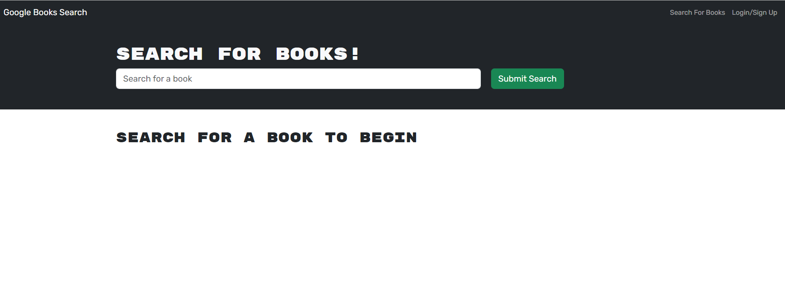

# My Books Search Engine

## Table of Contents

- [Description](#description)
- [Features](#features)
- [Technologies Used](#technologies-used)
- [Usage](#usage)
- [License](#license)
- [Contributing](#contributing)

## Description

My Books Search Engine is a web application that allows users to search for books by title, author, or keyword. The application is built using React, Node.js, Express.js, MongoDB, GraphQL, and Apollo Server. With this search engine users that sign up and/or log in can save books to their account and view saved books. 

## Features

- Search functionality for new books.
- User authentication with options for Signup and Login.
- Display of search results with book details and links to Google Books site.
- Ability to save books to user account.
- View saved books with options to remove from the list.

## Technologies Used

- React
- Node.js
- Express.js
- MongoDB
- GraphQL
- Apollo Server

## Usage

To begin working with the Book Search Engine, follow these steps:

1. Clone the repository to your local machine: `git clone https://github.com/thelmarivas/my-books-engine.git`.

2.Install the necessary dependencies using: `npm install`.

3. Set up an Apollo Server to handle GraphQL queries and mutations.

4. Start the server using: `npm start` or `npm run develop`.

5. Explore the search engine, login/signup functionality, and saving/removing books features.

Here is a screenshot of the application when running `npm run develop`: 
and the link to the deployed app on Heroku: [my-books-engine.herokuapp.com](https://my-books-engine-222f03430794.herokuapp.com/)

## License

This project is licensed under the MIT License. See the [LICENSE.md](./LICENSE) file for details.

## Contributing

Contributions are welcome, you can contact me for any suggestions or improvements.